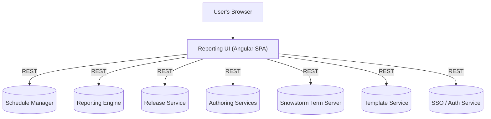
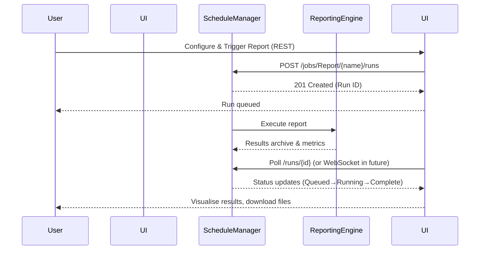

# SNOMED Reporting UI (Rep UI)

The **SNOMED Reporting UI (Rep UI)** is an Angular-based single-page web application that provides a rich user experience for running, monitoring and analysing **SNOMED CT clinical content reports**.  It acts as the front-end façade to the broader SNOMED International *Reporting Platform* and communicates with an ecosystem of backend micro-services—**Schedule-Manager**, **Reporting Engine**, **Release-Service**, **Authoring-Services**, **Snowstorm**, **Template-Service** and others—via RESTful APIs secured through the organisation’s SSO layer.

This document explains **how to run Rep UI locally** and the **engineering best-practices** expected when contributing to the code-base.

---

## 1  High-Level Architecture



<br/>

#### Typical Report-Run Lifecycle



Key points:
* **Stateless SPA** – all state is maintained server-side enabling horizontal scaling behind a CDN.
* Configurable **API base-paths** allow Rep UI to run behind a reverse proxy in any environment.
* **RxJS subjects & async pipes** power real-time queue and notification components.
* Built with **Angular 19**, **Bootstrap 5** & **Angular Material**, packaged by the Angular CLI.

---

## 2  Feature Highlights

* **Modern Angular 19 code-base** – strict TypeScript, standalone components and functional routing.
* **SSO-secured HTTP interceptors** – automatic JWT forwarding & renewal.
* **Queue panel & live status indicators** – driven by `QueueService` (`src/app/services/queue`).
* **Report wizard & results explorer** – create, re-run, download & delete report runs.
* **Integration points**
  * Schedule-Manager endpoints (`/schedule-manager/...`)
  * Release-Service endpoints (`/release-service/...`)
  * Authoring-Services & Snowstorm endpoints (`/authoring-services/...`, `/snowstorm/...`)
  * Template-Service for reusable report templates.
* **Rich component library** utilising Angular Material, ngx-bootstrap, FontAwesome & Toastr.
* **Cypress E2E test-suite** with Mochawesome reporting.
* **ESLint** enforced via pre-commit hooks.

---

## 3  Project Layout

```
src/
  app/                     ← Angular application sources
    components/            ← presentational & components
    services/              ← API clients, authentication, utilities
    models/                ← TypeScript interfaces & data models
    pipes/                 ← custom pipes
    interceptors/          ← HTTP interceptors (auth, error-handling)
  assets/                  ← static assets & SCSS
  environments/            ← build-time environment configs
cypress/                   ← end-to-end tests
```

Package conventions:
* `components`   stand-alone UI building blocks.
* `services`     HTTP clients, business logic & shared singletons.
* `interceptors` request/response cross-cutting concerns.
* `models`       Type definitions shared across the app.

---

## 4  Getting Started Locally

### 4.1  Prerequisites

1. **Node.js 22 LTS** (or newer)
2. **npm 9** (ships with Node) or **Yarn Classic**
3. (Optional) **Angular CLI** globally: `npm i -g @angular/cli`
4. Running instances (or mocks) of the backend services if you want realistic data:
   * Schedule-Manager, Reporting Engine, Release-Service, Authoring-Services, Snowstorm, etc.
   * A stubbed dev proxy can be used instead – see [`proxy.conf.json`](#proxy).

### 4.2  Clone & Install

```bash
git clone https://github.com/IHTSDO/reporting-ui.git
cd reporting-ui
npm ci          # deterministic install using package-lock.json
```

### 4.3  Serve (Development)

```bash
npm start       # alias for: ng serve --open
```

* The dev-server runs at `http://localhost:4200/` with live-reload.
* API calls are proxied to `http://localhost:8080/` (configurable via `proxy.conf.json`).

### 4.4  Build (Production)

```bash
npm run build:prod   # creates dist/reporting-UI/ with hashed assets
```

Artifacts are ready for static hosting (Nginx, Apache, S3, CloudFront, etc.).

---

## 5  Testing

* **End-to-end tests** – `npx cypress run` generates Mochawesome HTML reports under `cypress/reports/`.
* **Static analysis** – `npm run lint` (ESLint) & style-lint via pre-commit hooks.

---

## 6  Deployment

Rep UI is a static web bundle – deploy it to any web-server or CDN.

### 6.1  Docker (example)

```dockerfile
FROM nginx:1.26-alpine
COPY dist/reporting-UI /usr/share/nginx/html/reporting
COPY nginx.conf /etc/nginx/conf.d/default.conf
```

---
